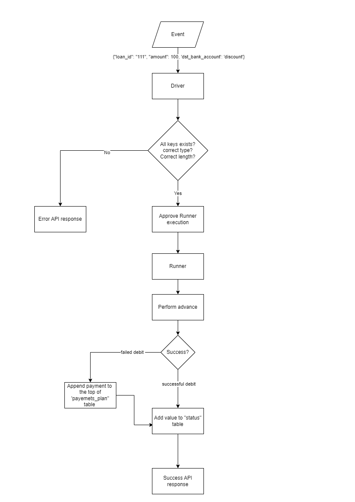
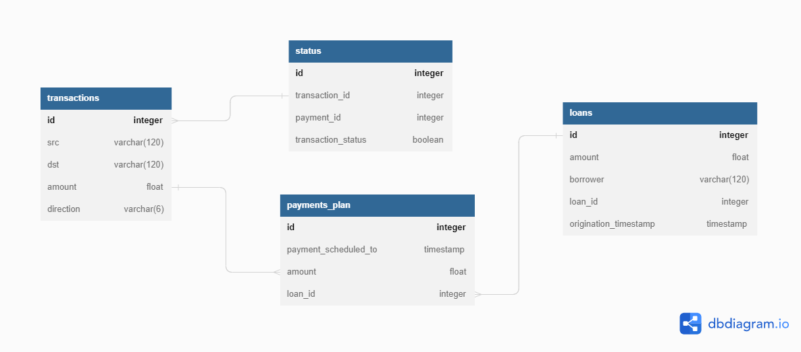

# Billing System - Alfabet 
----




----

## How to use

Main function: `caller`, which is in `system_handler` module.
Please insert the function the following input:

```
{"loan_id": str, "amount": int/float, 'dst_bank_account': str'}
```

## DB Structure


## Exceptions

###RE01
- Request Error 01
- Raised when not all necessary keys exists

###RE02
- Request Error 02
- Raised when input schema is wrong
###RE03 
- Request Error 03
- Raised when input length is wrong
###IE01
 - Internal Error 01
 - Raised when internal error occurs during Runner execution


### &copy; Ron Levy, 2023, ronlevy12000@gmail.com